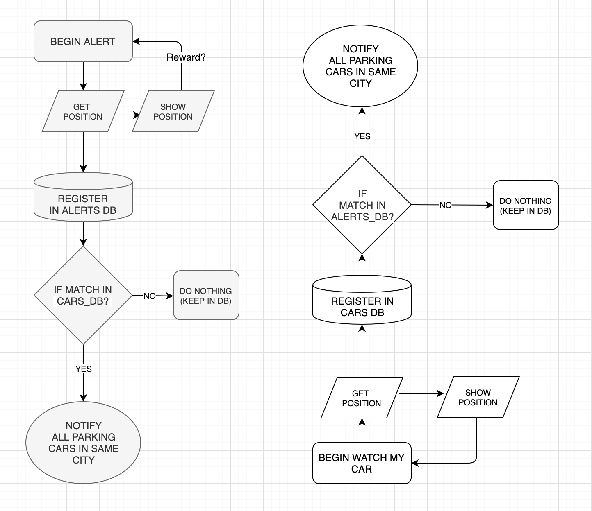

# Parking Watch

This project is an ongoing development for practicing purposes only. 
The app will be able to do two things: 

1. When user parks a car, user presses "Watch car button". This enables the app to "watch" if there are any parking attendants nerby. If so, user gets notified. 
2. When user see parking attendants, press "Alert" to notify users with parked cars nearby. 
3. The time for the "Watch" activity will be aprox. 10 min. 

# Requirements to run the application.

1. Clone or download the repository. 

2. Install https://nodejs.org/en/ in your computer. 

3. Go to root folder and run: npm install 

4. .env file needed for API_KEY, get one at https://developers.google.com/maps/ or ask for it, email me. 

# Run the application.

1. In terminal run the command: npm run dev
2. Go to your localhost:3000 and test it. 

# Tools used and links
 
This app is created with Node.js. and https://developers.google.com/maps/

# Flowchart

# Further development 
1. Insert a map.
2. Make it into a PWA. Insert a service worker for more functions like installing the app in users device, push notifications etc.
